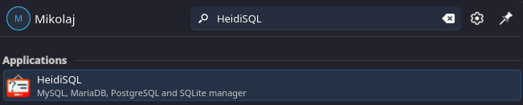
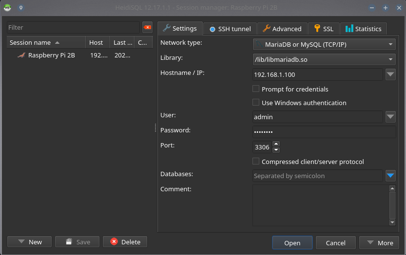

<p align="center">
  
</p>

<p align="center">
  Unofficial HeidiSQL GUI for NixOS
</p>

---

### Installation

Copy `heidisql.nix` into your configuration directory.
For example:
```
.
├── configuration.nix
└── heidisql.nix
```

Add this to your `configuration.nix`:

```nix
environment.systemPackages = with pkgs; [
  (import ./heidisql.nix { inherit pkgs; })
];
```

Then rebuild your system:

```bash
sudo nixos-rebuild switch
```

It should work from the application search bar or via command `heidisql`.



---

### Why?

HeidiSQL is a popular SQL client, but support in official `nixpkgs` is currently limited or missing.

This repository provides a minimal and clean workaround for NixOS users.

---

Feel free to create Issues, for now only the `/lib/libmariadb.so` database library is linked with the package.